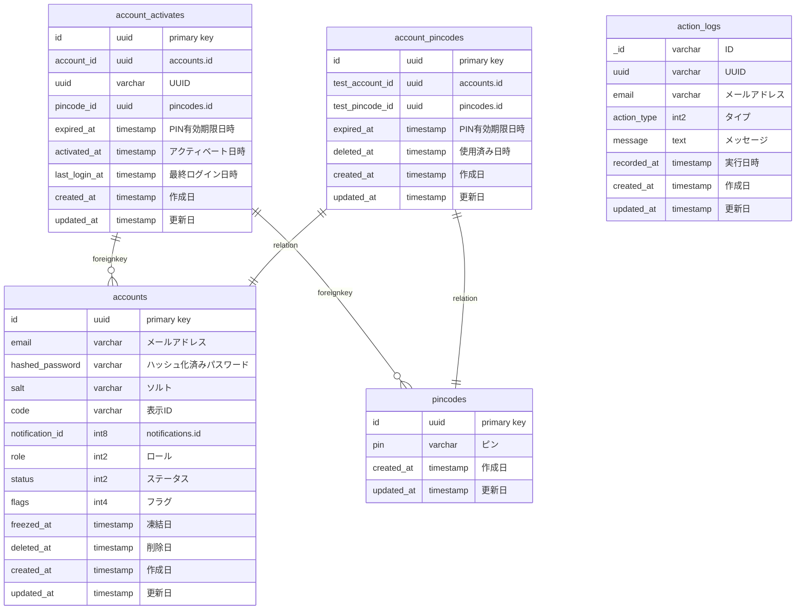

```mermaid
erDiagram

accounts {
  id uuid "primary key"
  email varchar "メールアドレス"
  hashed_password varchar "ハッシュ化済みパスワード"
  salt varchar "ソルト"
  code varchar "表示ID"
  notification_id int8 "notifications.id"
  role int2 "ロール"
  status int2 "ステータス"
  flags int4 "フラグ"
  freezed_at timestamp "凍結日"
  deleted_at timestamp "削除日"
  created_at timestamp "作成日"
  updated_at timestamp "更新日"
}

pincodes {
  id uuid "primary key"
  pin varchar "ピン"
  created_at timestamp "作成日"
  updated_at timestamp "更新日"
}

account_activates {
  id uuid "primary key"
  account_id uuid "accounts.id"
  uuid varchar "UUID"
  pincode_id uuid "pincodes.id"
  expired_at timestamp "PIN有効期限日時"
  activated_at timestamp "アクティベート日時"
  last_login_at timestamp "最終ログイン日時"
  created_at timestamp "作成日"
  updated_at timestamp "更新日"
}

account_pincodes {
  id uuid "primary key"
  test_account_id uuid "accounts.id"
  test_pincode_id uuid "pincodes.id"
  expired_at timestamp "PIN有効期限日時"
  deleted_at timestamp "使用済み日時"
  created_at timestamp "作成日"
  updated_at timestamp "更新日"
}

action_logs {
  _id varchar "ID"
  uuid varchar "UUID"
  email varchar "メールアドレス"
  action_type int2 "タイプ"
  message text "メッセージ"
  recorded_at timestamp "実行日時"
  created_at timestamp "作成日"
  updated_at timestamp "更新日"
}

%% accounts

%% pincodes

%% account_activates
account_activates ||--o{ accounts : "foreignkey"
account_activates ||--o{ pincodes : "foreignkey"

%% account_pincodes
account_pincodes ||--|| accounts : "relation"
account_pincodes ||--|| pincodes : "relation"

%% action_logs

```
